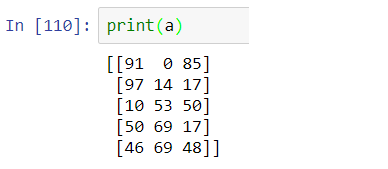
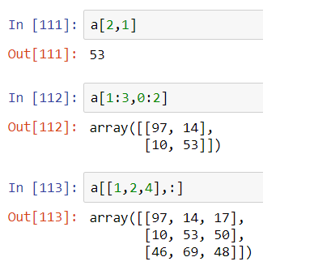

# Chapter 3: Calling elements in the DataFrame

In the previous chapter we have examined multiple ways to set up a dataframe from an existing dataset of a table. We showed that by printing the dataframe, it displays the whole table. However, in general, we will often need to access a subset of the table for process or analysis. In this chapter, we will discuss a few ways to achieve that. 


## A quick recap of NumPy array

As we mentioned in Chapter 1, Pandas share the same high-performance array manipulation feature from NumPy. NumPy is the short form of Numerical Python. It is one of the fundamental packages on which many other advanced packages are built. One important feature of NumPy is the notation of array similar to the array appeared in interpreted language such as C, C++ and Fortran. The C-binding of NumPy allows Python to access multi-dimensional array than using the standard list object. The way to call certain elements in a NumPy array has many similarities to that in Pandas. Therefore, we shall first review this feature in NumPy and then extend it to Pandas dataframe.

We will focus on 2-dimensional NumPy arrays as they correspond naturally to the structure of a dataframe. For a 2-dimensional array (or a rank-2 array), the element at *i*-row and *j*-column in an array *A* has an index *A*[*i, j*] (See Table 1 below). There are three ways to address elements in an array.

Table 1: A table showing the position notation

| Row  | Column 0 | Column 1 | Column 2 | Column 3 |
| ---- | -------- | -------- | -------- | -------- |
| 0    | [0,0]    | [0,1]    | [0,2]    | [0,3]    |
| 1    | [1,0]    | [1,1]    | [1,2]    | [1,3]    |
| 2    | [2,0]    | [2,1]    | [2,2]    | [2,3]    |


1. **Direct notation**

We can use the notation *A*[*i,j*] to refer to an element in a NumPy array *A*. 

2. **Colon notation**

When more than one elements are refereed to , similar to the list operation, a notation of *A*[*i1*:*i2*, *j1*:*j2*] may allow the user to points to a range of rows (*i1*, *i1+1*, *i1+2*, ..., *i2-1*) and columns (*j1*, *j1+1*, *j1+2*, ..., *j2-1*). Notice that the end values *i2* and *j2* are not included. 

3. **List notation**

When we want to access specific rows or columns in the array, and when they are not necessarily consecutive to each other, we can use a list to include the specific row and column numbers. For example, a notation *A*[[*i1*,*i2*,*i3*], *j1*] will correspond to an subarray made of the data in rows *i1*, *i2*, *i3* and column *j1*. Notice that unlike colon notation, only one list can be used in either row or column.  


Let us use a real example to illustrate these notation explicitly. Below, I will use NumPy to generate a table filled with random integer. We use an array filled with different numbers such that we can tell which rows and columns the numbers refer to. Here is the code

```python
import numpy as np
a = np.random.randint(min=0, max=100, size=(5,3))
```

For readers who are not familiar with this function, it means that *a* is a rank-2 array with 5 rows and 3 columns, filled with random integer from 0 to 100. In my laptop, the array *a* has the form displayed in Figure 1.

|  |
| :----------------------------------------------------------- |
| Figure 1: The random number array generated by my laptop     |


And some query using the three notations included above are shown in Figure 2.

|  |
| ------------------------------------------------------------ |
| Figure 2: Query of the array *a* using direct, colon and list notation |


## Calling dataframe elements by their address

Now we can proceed to discuss three ways to call the elements in a Pandas dataframe. For a dataframe, Pandas provides three distinctive methods to refer to the elements inside the dataframe. This includes:

1. The *iloc* method 
2. The *loc* method
3. The column name as its index


### The *iloc* method

The iloc method can be applied to a dataframe *df* by using the pattern:

```python
df.iloc[row_indices, column_indices]
```

The notation of the row and column indices follow the three notation style we have described for NumPy arrays. For example, the call by 

```python
df.iloc[[2,3,5],1]
```

corresponds to the elements of rows 2, 3, 5 at column 1. 

One major difference for *iloc* compared to NumPy array is that we can pass two lists of indices for the row and column simultaneously. We demonstrate this feature in Figure 3. 

|  |
| ------------------------------------------------------------ |
| Figure 3: Passing two lists to the *iloc* method to refer to specific rows and columns |


### The *loc* method

Pandas provides one more freedom in referring the elements. Instead of counting the row and column number in order to find which integer we should provide in the *iloc* method, Pandas let us pass the index and column names directly as a substitute of the integer index. Remember that we discussed about the naming of indices and columns in Chapter 2? In fact, providing a meaningful names to the columns, will provide very much convenience in calling the data without frequently referring to the original dataset. 

The *loc* method follows a similar pattern:

```python
df.loc[row_indices, column_indices]
```

The three notations for NumPy array can also be used in this method. Now let us reuse the dataframe in Figure 3 of Chapter 2, we can use 

```python
df_loc["Shop 1":"Shop 2", "Apple":"Kiwi"]
```

to refer to the rows from "Shop 1" to "Shop 2" and columns from "Apple" to "Kiwi". In Figure 4 we display the results on a Jupyter Notebook.

|  |
| ------------------------------------------------------------ |
| Figure 4: Calling subset of a dataframe using the *loc* method |

If we pay attention, we may notice a minor difference compared to the *iloc* method. The colon notation here actually includes the end value, which is not the case for the colon notation in the *iloc* method and in NumPy arrays. Also, the *loc* method also allows using two lists for both row and column for reference (See FIgure 5).  

|  |
| ------------------------------------------------------------ |
| Figure 5: Passing two lists to the *loc* method for referring to specific rows and columns |


### The column name as an index

The last method for referring to elements in a dataframe is to use the column names as the index. When we create a dataframe, in the *loc* and *iloc* methods the first index refers to the rows of the dataframe. However, the convention changes when we treat the dataframe as an array. The object does not store the data rows by rows, instead, from its attribute, data is grouped column by column. That means, when we consider the same table as above and type

```python
df["Shop 1"]
```

It will give an error message from the Python interpreter that no such column exists. In fact, Pandas stores the whole column as one of its attribute or index. Therefore, it is valid when we type

```python
df["Apple"]
```

And the interpret will return us the results shown in Figure 6. Notice that the output is a *Series* because the data itself is one-dimensional. 

|  |
| ------------------------------------------------------------ |
| Figure 6: Referring to an "index" of a dataframe             |

The list notation gives identical results as in the *loc* and *iloc* methods (See Figure 7).

|  |
| ------------------------------------------------------------ |
| Figure 7: Passing a list to the indices of a dataframe       |

However, the colon notation does not generate similar results. It only returns a frame containing the related column names in the query. In Figure 8 we show the results. So, this is an exception case we need to be aware of when using colon notation.

|  |
| ------------------------------------------------------------ |
| Figure 8: Passing colon notation to the indices of a dataframe |


### The column name as an attribute

A minor note to mention is that, we can also refer to the whole array also as an attribute of the dataframe. This gives the same result as using the column name as the index of the dataframe. For example, we can input

```python
df.Apple
```

to obtain the same series data as in Figure 6. However, this method has more constraints than passing the column name as an index. First, the attribute must not contain any symbol, space or numbers. Second, it only accommodates one column at a time. For operation on multiple columns, this method does not fit. 


## Summary

In this chapter we have reviewed briefly three different notations to refer to a NumPy array elements, including:

* direct notation
* colon notation
* list notation

These notations are used in Pandas in three methods to refer to elements in a dataframe based on the three notations above. They include:

* the *loc* method (refer to the names of the rows and columns)
* the *iloc* method (refer to the geometric position of the rows and columns)
* as an index or attribute (applicable to only columns)

Notice that there are minor differences in the exact operation using the three notations in these three methods. In the Table 2 below, we list out how they are different from each other. 


Table 2: Comparison of using three index notations in three element calling methods in Pandas

| Notation \ Method | *loc* method            | *iloc* method               | index |
| ----------------- | ----------------------- | --------------------------- | ----- |
| direct notation   | Yes                     | Yes                         | Yes   |
| colon notation    | Yes, end value included | Yes, end value not included | No    |
| list notation     | Yes                     | Yes                         | Yes   |


## Exercises

1. Given the dataframe *df* below (See Table 3), work in mind and then on a Python interpreter the expected output.

   ```python
   # exercises on iloc
   df.iloc[2,4]
   df.iloc[1:3,2:3]
   df.iloc[[1,3,4],[3,2]]
   
   # exercises on loc
   df.loc["C","Bart"]
   df.loc["Bart":"Chris", "C":"D"]
   df.loc[["Dane", "Bart"]]
   
   # exercises on column name as index and attribute
   df["Ann2"]
   df.Ann2
   df["A":"B"]
   df[["B","C"]]
   ```

   

Table 3: An artificial table for exercises 1 and 2

| Index | A    | B    | C    | D    | E    |
| ----- | ---- | ---- | ---- | ---- | ---- |
| Ann2  | 31   | 33   | 35   | 37   | 39   |
| Bart  | 11   | 13   | 15   | 17   | 19   |
| Chris | 21   | 23   | 25   | 27   | 29   |
| Dane  | 41   | 43   | 45   | 47   | 49   |
| Eaton | 51   | 53   | 55   | 57   | 59   |


2. Your friend wants to get an output as following (Table 4), which notation and method will you use? And what are the values of the passing rows and columns?


Table 4: The expected output

| Index | E    | B    | A    |
| ----- | ---- | ---- | ---- |
| Eaton | 59   | 53   | 51   |
| Chris | 29   | 23   | 21   |
| Ann2  | 39   | 33   | 31   |


