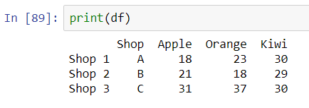

# Chapter 4: Adding, editing and removing entries 


In previous chapters, we have learnt how to create a dataframe and to query the values of elements in a dataframe. In this chapter, we will study how to modify the values of these elements. We will discuss how to add new rows and columns in a dataframe, then how to modify the values in a dataframe element-wise, row-wise and column-wise. Finally we discuss how to remove rows and columns. For the examples in this chapter, we shall reuse Table 3 in Chapter 2 for our discussion. Here we copy the original table in Figure 1 for our quick reference:


|         |
| -------------------------------------------------- |
| Figure 1: The table we will modify in this chapter |


## Adding new items

### Adding new row(s)

In general Pandas allows adding a new row through the use of *loc* method. When we passing a row name and the corresponding column data, Pandas first check if the row name or row index exists in the dataframe, if yes, then Pandas uses the passed data to modify the existing entry; if not, Pandas generates a new row with the index provided as the key. For example: 

```python
df.loc["Shop 4"] = ["D", 10, 20, 30]
```

Since there is no row "Shop 4" existing in the dataframe *df*, Pandas will create a new row where the value of each column corresponds to the element in the list, as shown in Figure 2. However, in passing the list, the length of the list must match the columns exactly, otherwise Python found it invalid and raises an error. 

|  |
| ------------------------------------------------------------ |
| Figure 2: Add a row by using a new index key as a reference  |


We can also pass a dictionary similar to how we declare a dataframe by using the method *append*. To do so, we need to define a dictionary where the key is the column name and the value to be the data for that column. The following script will generate the same dataframe as Figure 2. 

```python
new_entry = {"Shop":D, "Apple":10, "Orange":20, "Kiwi":30}
df = df.append(new_entry)
```

Pay attention that we need to use *df = df.append(...)* to make sure that the dataframe contains the new entry. It is because the method *df.append* returns the modified dataframe. It does not directly modify the original dataframe. If the modified dataframe is not passed to any variable, we will not be able to access the modified dataframe. 

The *append* has the flexibility that there can be columns where no value is given. In that case, we need to specific the flag *ignore_index = True* and Pandas fills the blanks by NaN. For example, it is valid to append the following dictionary.

```python
new_entry = {"Shop":D, "Apple":10, "Kiwi":30}
df = df.append(new_entry, ignore_index=True)
```

The output dataframe is given in Figure 3. 

|  |
| ------------------------------------------------------------ |
| Fig 3: Adding new rows with blanks to the dataframe          |


When more than one rows need to be added to the array, it is more convenient to create a new dataframe containing the new entries, and concatenate the new dataframe to the original one to form a larger dataframe. We demonstrate this method below.

```python
# pay attention to the list for each dictionary entry!
new_df = pd.DataFrame({"Shop":[D], "Apple":[10], "Kiwi":[30]})
df = df.append(new_df)
```

Pandas includes another function [*concat*](https://pandas.pydata.org/docs/reference/api/pandas.concat.html#pandas.concat) which has a similar usage. It provides more functionality than *append* that it allows adding new rows and columns, and flexibility when a dataframe with multiple indices is passed. For the time being, we focus on the basic use of this function.

```python
new_df = pd.DataFrame({"Shop":[D], "Apple":[10], "Kiwi":[30]})
df = pd.concat([df, new_df])
```


### Adding new column(s)

In Pandas, remember in Chapter 3 we have discussed that each column is an attribute or an index of the dataframe. As a result, adding new columns are equal to adding a new attribute to the dataframe object. Using the dataframe in Figure 1 as an example, we can do the following operation to add a column:

```
df["Pineapple"] = [2, 3, 5]
```

The output dataframe is shown in Figure 4.  Similar to adding a new row by a list, the list here must match the  number of rows in the original dataframe. 


|  |
| ------------------------------------------------------------ |
| Figure 4: Adding a new column by the index feature of Pandas. |


Notice that we can add the new column by assigning the data as an attribute of the dataframe. 

```python
df.Pineapple = [2, 3, 5]
```

Again, the naming by this approach can contain only alphabets, and no numerics, symbols or space allowed. 


Similar to adding rows, the function *concat* provides another way to add one or more columns efficiently. Notice that we use the parameter *axis=1* in the method. By default *axis=0* which corresponds to adding the new dataframe as new rows. To tell Pandas that we are adding new columns, we set *axis=1*.

```python
new_df = pd.DataFrame({"Pineapple":[2,3,5]}, index=["Shop1","Shop2","Shop3"])
df = pd.concat([df, new_df], axis=1)
```

Here, one may observe that we need to pass the index name for the dataframe *new_df*. It is because when Pandas merge two tables, it uses the index as the reference to match the two tables. When no index name is passed, the dataframe *new_df* contains index (0, 1, 2) only. Thus when the two dataframes merge, Pandas cannot find the index (0, 1, 2) in the dataframe *df*. What Pandas will do is adding three new entries with these indices and it results in a dataframe of 6 rows. 


## Editing a dataframe

### Modifying elements

We have introduced the notation *loc* and *iloc* for declaring and adding entries in a dataframe. These two functions can also be used to modifying the values in a dataframe accordingly. The new values will overwrite the original one. In Figure 5 we show the modified dataframe.

```python
df.loc["Shop 2":"Shop 3", "Apple"] = [2, 3]
```


|  |
| ------------------------------------------------------------ |
| Figure 5: Modifying elements in a dataframe                  |


We remind that the passing list conforms with the implied array size by the colon notation or list notation.


### Modifying rows

The modification of rows can be done easily similar to adding new rows. By using the existing index as a reference, we can modify the whole row according. For example, using the dataframe in Figure 1, the following script

```python
df.loc["Shop 2"] = ["D", 15, 17, 19]
```

will rewrite the original dataframe to that shown in Figure 6. 


|  |
| ------------------------------------------------------------ |
| Figure 6: Replacing a row in a dataframe                     |


When we replace multiple rows, we can use a list to store all the rows and pass the corresponding index names in a loop.


### Modifying columns

The operation is again very similar to adding a new column as discussed above. By stating the column names as the index of the dataframe (or as an attribute), we can pass the modified data to the dataframe and overwrite the original dataset. By adding the following script to the dataframe (Figure 1), we obtain a new *Kiwi* column.

```python
df.Kiwi = [35,12,37]	# or df["Kiwi"]
```


|  |
| ------------------------------------------------------------ |
| Figure 7: Replacing a column in a dataframe                  |


The length of the list to be passed in this manner again needs to respect the original number of rows in the dataframe. 


## Removing entries

In Pandas, we use the command [*drop*](https://pandas.pydata.org/docs/reference/api/pandas.DataFrame.drop.html) which is one of the dataframe object methods. It has the form 

```python
df.drop(labels=..., axis=..., index=..., columns=..., inplace=...)
```

This method is flexible that there are different ways to specify which rows or columns to be removed. The notation is very similar to those when we generate a new dataframe. The *axis* again specifies whether the names in *labels* are the row names of index names similar to *concat*. We need to specify the axis to tell Pandas whether we are deleting rows (axis=0) or columns (axis=1).  

Here we introduce an important parameter *inplace*. This is a boolean parameter (True or False). Whenever, we do operation like this to a dataframe, the operation returns a new dataframe which is modified. However, the new dataframe does not overwrite the original data by default. The following two scripts are equivalent:

```python
df(..., inplace=True)
```

and

```python
df = df(..., inplace=False)
```

For example, we may delete the column "Kiwi" in Table 1 by:

```python
df.drop(labels="Kiwi", axis=1, inplace=True)
```

The modified dataframe *df*  is shown in Figure 8. When we want to delete multiple rows or columns, we pass a list instead of a string to *labels*.


|  |
| ------------------------------------------------------------ |
| Figure 8: Delete a column in a dataframe                     |


## Modifying index and column names

Besides the elements in the dataframe, we can also change the index and column name using the [*rename*](https://pandas.pydata.org/docs/reference/api/pandas.DataFrame.rename.html) method of the dataframe. Renaming is particularly . The format is given by:

```python
df.rename(mapper=..., index=..., columns=..., axis=..., inplace=...)
```

Again, there are more than one way in using the rename operation. Either one of mapper, index and columns can be used to pass the dictionary where the key is the original names in the dataframe and the value being the new names. When *mapper* is passed, the axis value (0 for row and 1 for column) is needed for specification. The *inplace* allows us to change the original dataframe directly. The following two commands give the same results for the dataframe *df*:

```python
df.rename(mapper={"Shop":"Shop code", "Apple":"Pineapple"}, axis=1, inplace=True)
```

and 

```
df = df.rename(columns={"Shop":"Shop code", "Apple":"Pineapple"})
```

Both commands will modified the dataframe in the state displayed in Figure 9.


|  |
| ------------------------------------------------------------ |
| Figure 8: Renaming columns in a dataframe                    |


## Exercises


1. We want to edit the dataframe shown in Table 1. You receive this table which contains the information of the new staffs of some companies. Use the procedures described above to implement changes to the table. Try to use as many ways as you can for practice.

   | Staff | ID   | Branch      | Age  | Gender |
   | ----- | ---- | ----------- | ---- | ------ |
   | Ann   | A01  | New York    | 26   | F      |
   | Bart  | A02  | New York    | 35   | F      |
   | Chris | A03  | Los Angeles | 27   | F      |
   | Doug  | A04  | Los Angeles | 34   | M      |
   | Eaton | A05  | Los Angeles | 41   | M      |

   a. Add a new staff with the following information

   ​	Name: Fox, ID: A06, Branch: New York, Age: 40, Gender: F

   b. Change the name Bart to Barth

   c.  Change the gender of Barth and Chris to male.

   d. Replace the information of Eaton as follows:

   ​	Name: Eaton, ID: A07, Branch: New York, Age: 38, Gender: F

   e. Change the branch of Ann and Bart to Seattle and their gender to M

   f. Remove the entry of Eaton

   g. Remove the column "Gender"

   

2. One of the most common and tricky parts of handling a large database is the missing values. In Pandas we can pass the dataframe with missing values first and then fill the missing value with some pre-defined values. The dataframe method [*fillna*](https://pandas.pydata.org/docs/reference/api/pandas.DataFrame.fillna.html) does all the work to fill in the blank space which appears in the table. 

   ```python
   df.fillna(value=..., inplace=...)
   ```

   Here value is the number or string or list/dictionary you assign to replace the entry with a "NaN", inplace makes sure that your changes are stored in the original dataframe. Let us experiment with this dataframe method in this exercise. Let us start from the dataframe which contains Table 1.

   a. Add a new staff with the following information:

   | Name: Fox | ID: A06 | Age: 40 | Gender: M |
   | --------- | ------- | ------- | --------- |

   ​	Do you see there is one column now filed with NaN? 

   b. Now use the *fillana* method of this dataframe object and replace the NaN by the String "undefined"

   c. Then we know now Fox will move to Los Angeles for his branch. Change the table accordingly. 

   

3. In Figure 5, we have demonstrated how to modify a dataframe by using the *loc* method. If we want to use *iloc* instead, what are the indices to be passed? 

   
