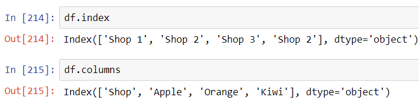
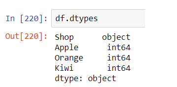
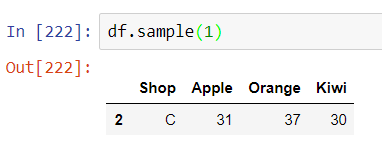
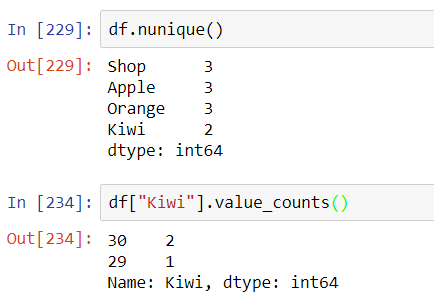
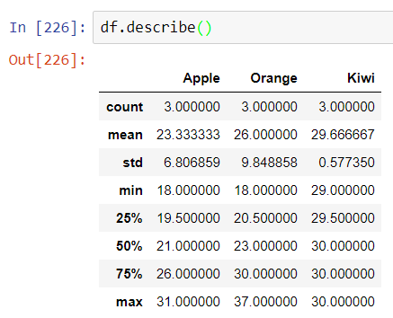

# Chapter 5: Describing a dataframe


In previous chapters we have learnt how to create, calling and modifying a dataframe. That will be sufficient for the most fundamental procedures one needs to do on a table. Now let's move on to something more advanced! In this short chapter, we will discuss some of the useful Pandas function which helps us to summarize the features about the dataframe we have created. Using these functionality will assist us to access the key features of the dataframe without scrolling up and down the dataframe. For demonstration purpose, we again use the Table 3 in Chapter 2 in most of the examples here. I show the table again so that we can have a quick reference. 


|         |
| -------------------------------------------------- |
| Figure 1: The table we will modify in this chapter |


## Dataframe size and dimension

The dataframe in Pandas inherited the NumPy arrays, so we can access the number of rows and columns by the shape attribute

```python
df.shape
```

For example, the dataframe of Figure 1 has a shape (3, 4). This corresponds to 3 rows and 4 columns. 


And we can access the number of rows by using

```python
len(df)
```

but notice that it cannot access the number of columns directly. If we really need to use this method to access the number of columns, we first extract one row by *loc* or *iloc*, and then use the *len* method, i.e.

```python
len(df.loc["Shop 1"])
```

Notice that the choice of row does not matter. 


A less used attribute *size* reports the number of elements in the dataframe:

```python
df.size
```

For example, the table in FIgure 1 has a size 12. 


At last, the attribute *ndims* tells if the table is a dataframe by checking its dimension:

```python
df.ndims
```

A dataframe has *ndims=2* and a series has *ndims=1*.


## Dataframe index and column names

Besides by observing of the table directly, we can use the *index* attribute of the dataframe to call all the index in the dataframe:

```python
df.index
```

Similarly we use the *columns* attribute to call all the column names used in the dataframe, we type

```python
df.columns
```

Notice that both returns a Pandas series, which is also an iterable. We can loop over these series to access the rows or columns one by one for specific operations.  In Figure 2 we show the results of the above two commands. 


|  |
| ------------------------------------------------------------ |
| Figure 2: Querying the indices and columns of a dataframe    |


## Dataframe datatype

A good practice for using Pandas is that data in one single column uses a single datatype. This makes sure that operations by column will have a reduce chance of Type Error. In particular, it can be difficult to screen out invalid entries in a large dataset. Knowing the global data types will help us distinguish if some entries are "contaminated" during data preparation. We use

```python
df.dtypes
```

to check the data type of each column. The sample result for the table in Figure 1 is shown in FIgure 3.


|  |
| ------------------------------------------------------------ |
| Figure 3: Querying the data types of a dataframe             |


## Dataframe sample data

When we work on a large dataframe, it is useful for us to only examine a few rows of a table to gain the first impression about the data. It will assist us to decide what further processing steps are necessary. The methods *head*, *tail* and *sample* of a dataframe are useful for these tasks. Namely, we use 

```python
df.head(5)
```

to display the first 5 rows of the dataframe, 

```python
df.tail(5)
```

to display the last 5 rows of the dataframe, and

```python
df.sample(5)
```

to ask Pandas to return 5 rows randomly from the dataframe. The number here can be changed according to the extent we want to examine the data. In Figure 4 we ask Pandas to randomly return a row from the dataframe *df*. 


|  |
| ------------------------------------------------------------ |
| Figure 4: Querying a random row of a dataframe               |


## Unique values and counting

In looking at a table, it is useful to extract the unique values appearing in the dataframe. In Pandas we can use the method [*nunique*](https://pandas.pydata.org/docs/reference/api/pandas.DataFrame.nunique.html) to count the unique values in each column in a dataframe. We can then use [*value_counts*](https://pandas.pydata.org/docs/reference/api/pandas.DataFrame.value_counts.html) to find the unique values of a column and their frequencies. Notice that the method *value_counts* applies on a specific column. If no column is given, it results in an error. In Figure 5 we demonstrate these features to our dataframe *df*. We see that there are 3 unique values in all columns except "Kiwi", where the 2 unique values are 29 and 30 respectively. 


|  |
| ------------------------------------------------------------ |
| Figure 5: Querying the unique values and their frequencies of a dataframe |


## Describe a dataframe

The last useful command introduced in this Chapter is the *describe* method. This gives a set of statistics description of the dataframe column by column. This will help us to quickly grasp the statistical features of a dataframe. In Figure 6 we demonstrate this attribute to our *df* dataframe. We observe that Pandas not only report statistical quantities such as count, mean and the range of values, but also the percentile of the data. Notice that Pandas automatically ignores columns which contain non-numerical data, such as the "Shop" column of the dataframe *df*. 


|  |
| ------------------------------------------------------------ |
| Figure 6: Querying the basic statistics of a dataframe       |


## Summary

In this short chapter, we have examined multiple useful attributes and methods which give an overview of the dataframe we are processing. They include:

* shape, size, ndims 
* index, columns
* dtypes
* head, tail and samples
* nunique and value_counts
* describe

Using these attributes and methods flexibly will greatly help us to analyze the data structure of the dataframe we are working on.


## Exercises

1. Let's try it on your own. This time let us prepare a slightly larger dataset as follows (Table 1). And try to use the above methods and attributes to analyze the dataframe. (And not by observation of naked eyes!)

   

Table 1: The practice table for exercise 1

| Rank | Shop | Apples | Oranges | Kiwi | Mangoes |
| ---- | ---- | ------ | ------- | ---- | ------- |
| 1    | A    | 18     | 19      | 22   | 30      |
| 2    | B    | 24     | 14      | 25   | 13      |
| 5    | C    | 42     | 34      | 34   | 13      |
| 4    | D    | 15     | 36      | 23   | 54      |
| 3    | E    | 15     | 14      | 24   | 13      |
| 6    | F    | 42     | 14      | 53   | 36      |


​		a. Build the dataframe using the data in Table 1

​		b. How many rows and columns are there?  

​		c. Display the first 3 rows in the dataframe. 

​		d. Write a for loop and display the column names one by one

​		e. What are the average number of apples and kiwi?

​		f. What is the maximum number of oranges and minimum number of mangoes?

​		g. What is the 75% percentile of Kiwi?

​		h. Which column has the most unique values? 

​		i. What are the unique values found in the column "Apple"?

