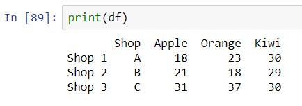
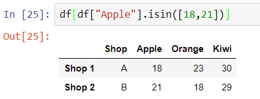

# Chapter 6: Query and Column operations (I)


In previous chapters we have learnt the basic of building, calling, modifying and describing the dataframe. They can serve as the fundamental manipulation of a table. In this chapter we shall explore the essence of Pandas, including data query and column operations. With these operations, we may handle large dataset by imposing certain modification rules without going through the data one by one. 

Again, we will use our old friend, Table 3 in Chapter 2 as our example (Figure 1). 


|         |
| -------------------------------------------------- |
| Figure 1: The table we will modify in this chapter |


## Query the subset of a table

To obtain a subset of the dataframe, we provide the criterion to the dataframe as its index. The method is similar to calling the data by column names. For example: the command

```python
df[df["Orange"] < 30]
```

corresponds to the dataframe subset where the value in the "Orange" column is less than 30. This will give us a dataframe of only 2 rows as shown in Figure 2. 


|  |
| ------------------------------------------------------------ |
| Figure 2: Filtering a dataframe with a criterion             |


Notice that if we type only

```python
df["Orange"] < 30
```

this corresponds to a series of boolean of whether the "Orange" column in each row is less than 30 or not. It does not return a subset of dataframe. 


Multiple query can be used by combining criteria with "&" (and) and "|" (or). For example,

```python
df[(df["Orange"] < 30) & (df["Apple"] > 20)]
```

will give us the dataframe consisting of only Shop 1 because this is the only row which contains the "Orange" column with a value less than 30 and the "Apple" column with a value greater than 20. Notice that we always need a bracket to enclose each of the argument. In Figure 3, we show how this operation filters the dataframe in Figure 1.


|  |
| ------------------------------------------------------------ |
| Figure 3: Filtering a dataframe with multiple criteria       |


In some cases, we only want to select some specific values instead of using inequalities, in that case we need to use the method *isin* of the dataframe. The method *isin* takes an iterable (e.g., list) to check and return the subset of the dataframe whose values appear in the iterable. For example, we may select the row where the "Apple" column has a value 18 or 21, then we can write:

```python
df[df["Apple"].isin([18,21])]
```

In Figure 4, we show how this method can be used to a dataframe of Figure 1. 


|  |
| ------------------------------------------------------------ |
| Figure 4: Filtering a dataframe with selected values         |


## Basic column operations

After learning how to select the part of the dataframe we find interesting, then we can begin our operations. Pandas allows direct arithmetic operation on the data in the same column such as :

```python
df["Orange"] += 1
```

We may observe in Figure 5, indeed, all the values in the "Orange" column have increased by 1. Others, such as "-=", "*=", "/=" are also valid operations to the whole array. If we want to use the method approach, we can use the methods *[add](https://pandas.pydata.org/docs/reference/api/pandas.DataFrame.add.html)*, *[sub](https://pandas.pydata.org/docs/reference/api/pandas.DataFrame.sub.html)*, [*mul*](https://pandas.pydata.org/docs/reference/api/pandas.DataFrame.mul.html) and [*div*](https://pandas.pydata.org/docs/reference/api/pandas.DataFrame.div.html) to a dataframe. The above command is equivalent to writing

```python
df = df["Orange"].add(1)
```

But notice that these methods return a new dataframe instead of modifying the original dataframe. 


|  |
| ------------------------------------------------------------ |
| Figure 5: Modifying a dataframe in the same column           |


When more than one columns are passed, instead of a scalar, we can pass a list so that the operation depends on the elements in the list. Let us try to modify the dataframe of FIgure 1 by the following command (In case you have modified the original dataframe, rerun the dataframe declaration!): 

```python
df[["Apple", "Orange"]] += [2,3]
```

The results are shown in Figure 6 for illustration,


|  |
| ------------------------------------------------------------ |
| Figure 6: Modifying a dataframe in the same column by multiple values |

Again, pay attention that the shape of the dataframe (i.e., the number of columns) should match the size of the list for consistency. 


Similar operations can be done on data in a row. However, this method is seldom used as in general, along the same row, there can be columns which contain strings. In that case, Python will raise an error when we attempt to do algebraic operation on these columns. In that case, we need to use the *loc* method to select columns containing only numbers and apply operations on it, such as:

```python
df.loc["Shop 1", "Apple":"Orange"] += 1
```

and 

```python
df.loc["Shop 1", "Apple":"Orange"] = df.loc["Shop 1", "Apple":"Orange"].add(1)
```

will provide the same dataframe result in Figure 7 using the dataframe in Figure 1. Again, it is possible to pass a list so that each column is operated with different values.


|  |
| ------------------------------------------------------------ |
| Figure 6: Modifying a dataframe in the same row              |


## Multiple-column operations

In most of the data analysis, we need to combine data from multiple columns to create a new column which contains the digested data. The procedure is similar to how we create a new column, but with the data computed from the current columns. For example, we can write

```python
df["Sum"] = df["Apple"] + df["Orange"] + df["Kiwi"]
```

to create a new column called "Sum" and its value is the sum of three columns, "Apple", "Orange" and "Kiwi". In Figure 8, we do this operation on the Figure 1 dataframe.


|  |
| ------------------------------------------------------------ |
| Figure 8: Creating a new column by operating on multiple columns |


Notice that, in Pandas there are a number of built-in methods which can speed up simple statistical method like this. They include *sum*, *std*, *min*, *max*, *median*, *mode* and so on. For example, the above example can be replaced by the operation:

```python
df["Sum"] = df[["Apple", "Orange", "Kiwi"]].sum(axis=1)
```

This command means that we extract the columns "Apple", "Orange" and "Kiwi", compute their sum and form a series. The series has a length equals to the original dataframe row numbers. Then we put this series in the "Sum" column of the original dataframe. Again, we need to define *axis=1* to specify Pandas that we are calculating the sum along the same row, not along the same column. The *axis* setting applies to all these statistical methods. 


## Transforming data by *where* and *mask*

When we need to modify a partial part of the row, we may need to extract the data, modify it and then replace the data. In that case, we need to use *mask* and [*where*](https://pandas.pydata.org/docs/reference/api/pandas.DataFrame.mask.html#pandas.DataFrame.mask). Both functions have very similar functions expect that *mask* acts on rows where the condition is true while *where* does the opposite. A command below can be used to extract the "Apple" row where the "Apple" column value is less than 25 (correspond to Shop 1 and 2), and then replace the original value by 20. The function inplace makes sure that the operation modifies the original data. 


|  |
| ------------------------------------------------------------ |
| Figure 9: Extract rows and replace rows with selected data   |


Another indirect way to change the row data can be done by 

1. extracting the relevant rows by filtering as shown at the beginning of the chapter,
2. modify the data accordingly,
3. overwrite the original data with the modified data. 

A major shortcoming in using mask is that the value to replace the original data cannot be a variable. This largely limits the application of this method to a general dataframe. 


## Transforming data by *apply*

In fact, the method [*apply*](https://pandas.pydata.org/docs/reference/api/pandas.DataFrame.apply.html) in Pandas provide a powerful tool to connect a dataframe to more sophisticated functions or methods for advanced processing. To use the *apply* method we need to define a named function or a lambda function so that we pass this function to the *apply* method, and the *apply* method uses this function to operate on data in the dataframe. 

As an example, let us define a method *add_one* which, suggested by its name, add one to the passing value. We use *apply* to pass this method to the dataframe and create a new column called "Apple2".

```python
def add_one(value):
    return value+1

df["Apple2"] = df["Apple"].apply(add_one)
```

In Figure 10 we demonstrate how we can combine the *apply* method with this *add_one* method. 


|  |
| ------------------------------------------------------------ |
| Figure 10: Extract rows and replace rows with selected data  |


When a function needs more than one parameters passed, we need to do it indirectly in the *apply* method as Pandas does not pass individual columns separately like what we do for a function with multiple arguments. We need to use a lambda function to call this multi-argument function, and extract the individual values explicitly. For example, if we want to create a new column defined by the operation

```python
df["New sum"] = df["Apple"] + 2 * df["Orange"] + 3 * df["Kiwi"]
```

In fact the above line is appropriate to create a new column by the above formula. For pedagogical purpose, let us demonstrate the *apply* method explicitly. We need to construct the script as follows:

```python
def new_sum(value0, value1, value2):
	return value0 + 2 * value1 + 3 * value2

df["New sum"] = df.apply(lambda row: new_sum(row["Apple"], row["Orange"], row["Kiwi"]))
```

We do not need to modify the function being passed. Instead we need to use a lambda function to call this function before using *apply* method because we want to extract values from the required columns. We show in Figure 11 how this method act on out reference dataframe shown in Figure 1. 


|  |
| ------------------------------------------------------------ |
| Figure 11: Extract rows and overwrite with multi-argument functions |


## Summary

In this chapter we have done an extensive overview in some useful methods to extract data and modify them. We have studied how to make a query to extract rows which satisfy the given criterion(a). Then we have discussed how to modify data in the whole row and columns. For partial column modification of the data, we need to use 

* mask: apply to rows which satisfy the condition
* where: apply to rows which do not satisfy the condition

We also demonstrated how to use the *apply* method to modify algebraic data. 


## Exercises


1. Consider the dataframe in Figure 12, which shows some fictional data of bank users, write the query to extract the data with the following conditions:

   a. Bank users with an age below 20

   b. Bank users with an age above 20 and with cash more than 50

   c. Bank users with cash or saving more than 50

   (Do you remember how to check how many users satisfy these conditions?)

   

|  |
| ------------------------------------------------------------ |
| Figure 12: Dataframe for Exercises 1 to 3                    |


2. Do the following modification by row or column:

   a. Add all the age of the users by 1

   b. Add cash by 10 for users whose age is below 20 (Try use both *mask* and *where* methods)

   c. Add Dorothy and Felix's saving by 10

   

3. Then let us do more operation on the column data

   a. Use *apply* method to generate a new column called total which is the sum of cash and saving

   b. Find how many users have a total above 100

   c. Assume that at the end of the year, the bank pays an interest rate according to their age by the following formula

   ```python
   rate = (age - 10) # in percent
   ```

   update the saving of all users.
